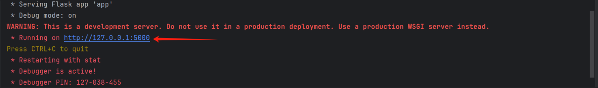
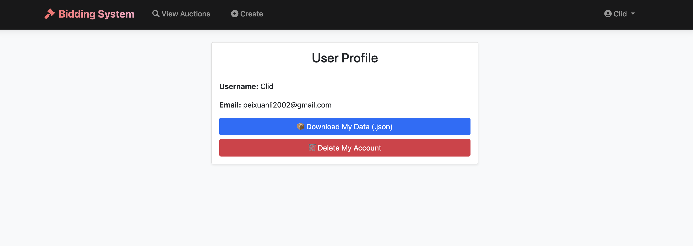
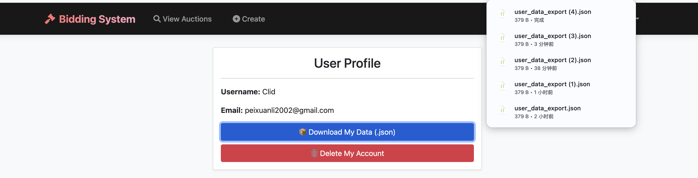
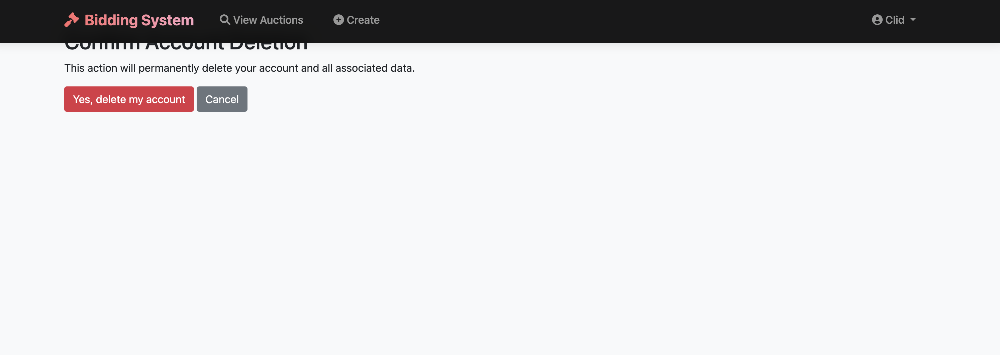

# S_P-Course-work_Group_22
## Project Overview
This is a Flask-based online auction system that allows users to register, log in, create auction items, participate in bids, and manage auctions.

## System Features
1. User Authentication Functions
- User Registration: New users can create an account through the registration page.
- User Login: Registered users can login to the system using their credentials.
- User session management: the system keeps users logged in.
 2. Auction Management Functions
- Browse Auctions: View all active and closed auctions.
- Create Auction: Logged in users can create new auctions.
- Participate in bidding: users can bid on the auction items they are interested in.
- Close Auction: Auction creator can close the auction early.
 3. Auction details
- View details: displays detailed information about an auction item
- Bidding history: view all bids placed on an item.

## File structure
1. app.py - the main application entry file, which initializes the Flask application and configures routing.
2. config.py - system configuration file, contains database connection and key settings.
3. models.py - database model definition file
4. auth.py - user authentication related routes and logic
5. bidding.py - routing and logic for auction operations
6. init_db.py - database initialization scripts
7. templates/ - HTML templates folder
## How to Use

1. **Clone the Repository**  
    ```bash
    git clone https://github.com/qijia0810/S_P-Course-work_Group_22.git
    cd S_P-Course-work_Group_22
    ```

2. **Install Dependencies**  
    Ensure you have the required dependencies installed. Run:  
    ```bash
    pip install -r requirements.txt
    ```

3. **Run the Application**  
    Start the application with:  
    ```bash
    python app.py
    ```
    Click on the URL you get to access the Bidding System.
    

## Guidelines for use
1. Register for an account: Visit the registration page and fill in the necessary information to create an account.
2. Log in to the system: Log in with your registered credentials.
Can be logged in as a test user
Username: test
Password: test
3. Browse Auctions: View all current auctions.
4. Create an auction:
   - Click on the “Create Auction” button.
   - Fill in the auction title, description, starting price and duration.
   - Submit the form
5. Participate in bidding:
   - Find an auction item of interest
   - Enter a bid amount above the current price
   - Submit a bid
6. Manage the auction:
   - As the auction creator, you can end the auction early.
   - Check the status of the auctions you have created.
  
## GDPR requirements: Data portability and rights to erasure
When clicking the dropdown menu named `Profile` on the top-right corner of the webpage, user will be redirected to a profile page like this:


Click on `📦 Download My Data (.json)`, user will be able to download a json file containing user's username, email, historical activities(auctions created and bids made).


Click on `🗑️ Delete My Account`, user will be directed to a page asking for confirmation of account deletion.

- click on `Yes, delete my account `, user account will be permanently deleted.
- click on `Cancel`, this operation will be halted and user will be redirected to homepage.