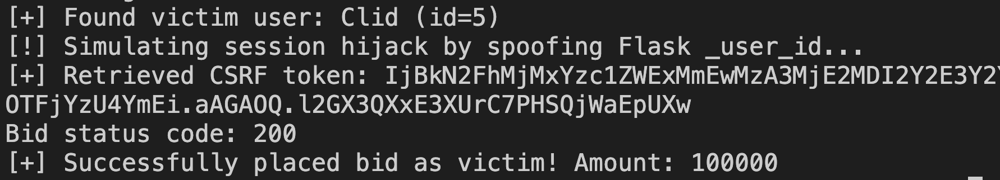
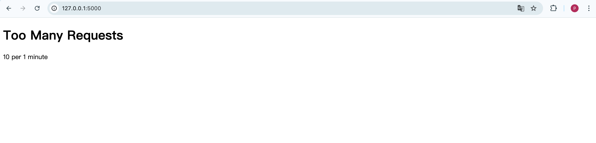

# 🧪 Simulating DoS Attack Using Locust

This guide explains how to simulate a basic DoS-style stress test against our Flask bidding system using Locust, a scalable and scriptable load testing tool.

## 🧱 Step 1: Launch Locust Web Interface

In the project root directory:
```
locust -f chain2/locustfile.py
```
This will start Locust and serve a control interface at:

http://0.0.0.0:8089

## 🧪 Step 2: Start the Simulation

Open `http://localhost:8089` in your browser

Fill in the form:

Number of users: e.g., 100

Spawn rate: e.g., 10 (users per second)

`Host: http://127.0.0.1:5000`

Click “Start Swarming”

Now you are simulating concurrent access to the homepage, similar to a DoS attack.

## 📊 Step 3: Observe Results

Locust provides real-time stats:

Requests per second (RPS)

Response time distribution

Failure count

Watch how your Flask server responds. If it slows down or crashes, that indicates a bottleneck.

However, the system remained accessible due to the simplicity of the homepage route and the limitations of a single-machine simulator. In real-world conditions, especially under DDoS with multiple geographic sources, this Flask application would likely become unavailable due to lack of rate-limiting, reverse proxying, or request queue management.

# Corresponding Secure Policy
We implemented a basic rate-limiting strategy using Flask-Limiter to defend against high-volume request flooding. By limiting endpoints like `/login` and `/bid` to 5–10 requests per minute per IP, the system can resist simple DoS and low-level DDoS attacks without relying on external infrastructure.

Returns after limit exceeded 429 Too Many Requests
