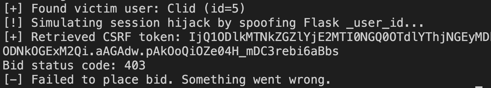

# 🛡️ Session Hijacking Attack

This section demonstrates how a session hijacking attack was successfully simulated on our auction system before and after implementing token validation using a @require_valid_token decorator.

## 🚨 Scenario: Session Hijacking Without Token Validation

In the original system, Flask-Login determines login status based on the presence of a _user_id field in the session. This allowed an attacker to manually inject this value and impersonate another user.

## ✅ Attack Steps

Attacker accesses the database or use social engineering and extracts the victim's user ID and.

The attacker uses Flask's test client to spoof the session:
```
with client.session_transaction() as sess:
    sess['_user_id'] = str(victim_user.id)  # Spoof login
```
The attacker then accesses the auction page, extracts the CSRF token, and submits a POST request to place a bid:
```
response = client.post(
    f'/auction/{auction_id}/bid',
    data={'bid_amount': 9999.99, 'csrf_token': csrf_token},
    follow_redirects=True
)
```
Result: The server accepts the request, responds with 200 OK, and the bid is placed under the victim's identity.

## Test
In the main working directory(not in chain3 directory), simply run
```
python simulate_session_hijack_attack.py
```
📋 Output Example:


# ✅ Corresponding Security police: Adding @require_valid_token Decorator

To defend against such session hijacking, we introduced a @require_valid_token decorator that checks whether the session's auth_token matches the one stored in the server-side database:
```
@require_valid_token
@login_required
@app.route('/auction/<int:auction_id>/bid', methods=['POST'])
def place_bid(auction_id):
    ...
```
At login time, the system stores the authenticated token in the session:

`session['auth_token'] = new_session.token`

The decorator enforces that only sessions with a valid (user_id, token) pair in the database can access protected actions.

## 🔒 Post-Mitigation Behavior

After applying @require_valid_token, the same attack flow fails:

The attacker can still spoof _user_id and obtain a CSRF token.

However, the auth_token is missing or invalid.

The server responds with 403 Forbidden, and no bid is placed.

📋 Output Example:


✅ Conclusion

By introducing token-based session validation, we successfully prevented attackers from exploiting session hijacking vulnerabilities. This reinforces the importance of not trusting client-modifiable session fields like _user_id without server-side verification.

This change effectively neutralizes the spoofed session attack while preserving a seamless experience for legitimate users.

