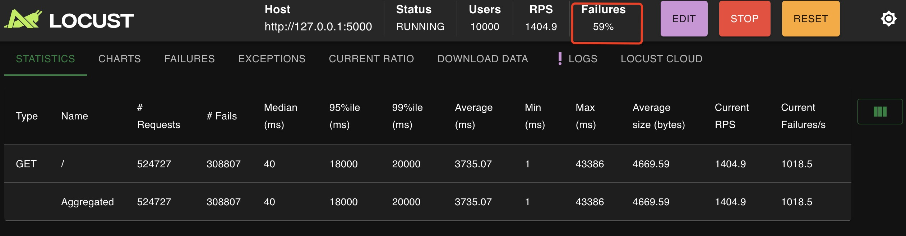
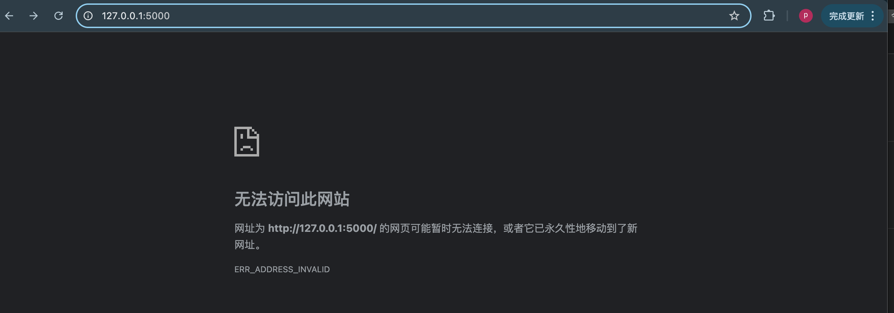
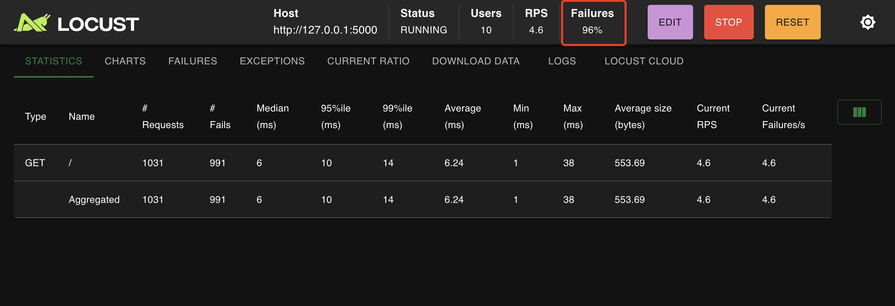

# 🧪 Simulating DoS Attack Using Locust

This guide explains how to simulate a basic DoS-style stress test against our Flask bidding system using Locust, a scalable and scriptable load testing tool.

## 🧱 Step 1: Launch Locust Web Interface

In the project root directory:
```
locust -f chain3/locustfile.py
```
This will start Locust and serve a control interface at:

http://0.0.0.0:8089

## 🧪 Step 2: Start the Simulation

Open `http://localhost:8089` in your browser

Fill in the form:

Number of users: e.g., 10000

Spawn rate: e.g., 100 (users started per second)

`Host: http://127.0.0.1:5000`

Click “Start Swarming”

Now you are simulating DDoS attack: start 100 users per second step by step until the Number of users 10000 is reached, ultimately 10000 malicious users concurrently access to the homepage.
## 📊 Step 3: Observe Results

Locust provides real-time stats:

`Requests per second (RPS)`

`Response time distribution`

`Failure rate`

The number of requests sent by Locust grows rapidly(up to more than 500k in the screenshot), and at first the server can cope, but as the number of malicious attackers increases, the server starts to become overwhelmed, as shown by the increase in the failure rate(59%) in the graph, meaning that server can not cope with 59% of total requests.

Eventually, the server crashes and we can not access it. As shown in the screenshot below, the server is temporarily unavailable. 


The Chinese words translates to 
```
Unable to access this site
The page with the URL http://127.0.0.1:5000/ may be temporarily unavailable, or it has been permanently moved to a new URL.
ERR_ADDRESS_INVALID
```

# Corresponding Secure Policy
We implemented a basic rate-limiting strategy using Flask-Limiter to defend against high-volume request flooding. By limiting endpoints like`/`, `/login` and `/bid` to 5–10 requests per minute per IP, the system can resist simple DoS and low-level DDoS attacks without relying on external infrastructure.

With this protection being implemented, you can view on the locust dashboard that the failure rate is very high(96%) even if only 10 users concurrently asscess the webpage, suggesting it's impossible to crash the server with low-level DDoS attack.
